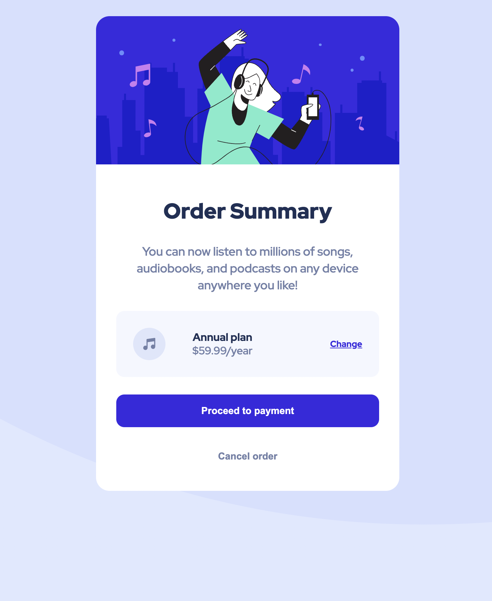

# Frontend Mentor - Order summary card solution

This is a solution to the [Order summary card challenge on Frontend Mentor](https://www.frontendmentor.io/challenges/order-summary-component-QlPmajDUj). Frontend Mentor challenges help you improve your coding skills by building realistic projects. 

## Table of contents

- [Frontend Mentor - Order summary card solution](#frontend-mentor---order-summary-card-solution)
  - [Table of contents](#table-of-contents)
  - [Overview](#overview)
    - [The challenge](#the-challenge)
    - [Screenshot](#screenshot)
    - [Links](#links)
  - [My process](#my-process)
    - [Built with](#built-with)
    - [What I learned](#what-i-learned)
    - [Continued development](#continued-development)
  - [Author](#author)
  - [Acknowledgments](#acknowledgments)


## Overview

### The challenge

Users should be able to:

- See hover states for interactive elements

### Screenshot



### Links

- Solution URL: [Solution](https://github.com/stwaldo/order-summary-component)
- Live Site URL: [Live site](https://stwaldo.github.io/order-summary-component/)

## My process

### Built with

- Semantic HTML5 markup
- CSS custom properties
- Flexbox

### What I learned

Basic markup of a page to get the frame set up correctly, and some good rule-of-thumb CSS to style a page to match the required spec.

```html
<h1>Some HTML code I'm proud of</h1>
```
```css
.proud-of-this-css {
  color: papayawhip;
}
```
```js
const proudOfThisFunc = () => {
  console.log('🎉')
}
```

### Continued development

Would like to explore using frameworks to streamline styling, and get a better grasp at pros/cons of using pure CSS vs. pre-compilers like SASS/LESS, on top of styling frameworks like Bootstrap.

## Author

- Frontend Mentor - [@stwaldo](https://www.frontendmentor.io/profile/stwaldo)
- Twitter - [@stwaldo](https://www.twitter.com/stwaldo)

## Acknowledgments

h/t to [Madison Kanna](https://www.youtube.com/c/MadisonKanna) and [freeCodeCamp.org](https://freecodecamp.org) for the guides and lessons.